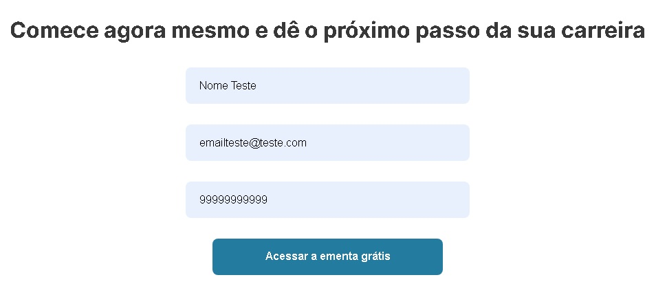
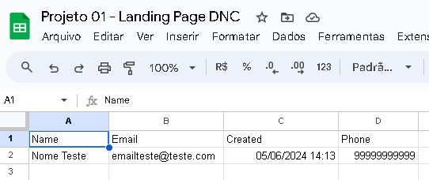
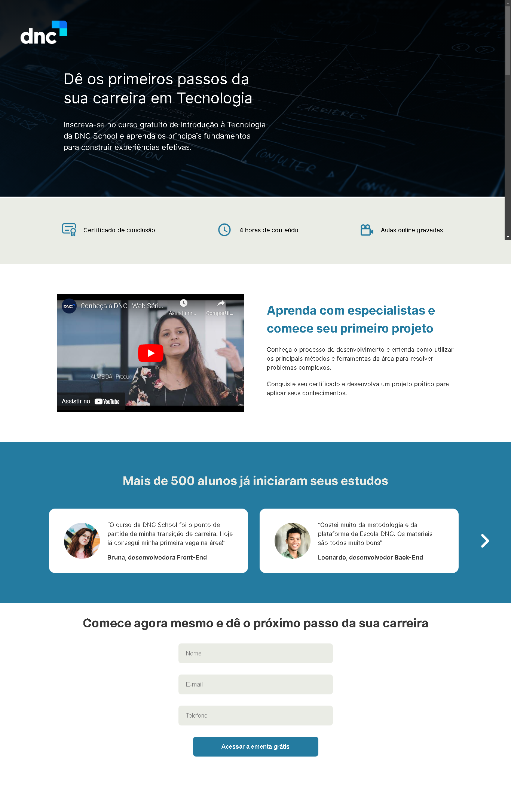

# Projeto 01 - Landing Page DNC

### 🎨 [Layout proposto no Figma](https://www.figma.com/file/ZpH9zHhUABIpLwli1Xp3z3/[TECH]-Case-Mentorias---Landing-Page-DNC-School?type=design&node-id=0-1&mode=design&t=tHbTkpOvKq4xzrpE-0)

### 🚀 [Deploy](https://geovanaborba.github.io/DNC_formacaoFullStack/Projetos_de_Estudo/Projeto%2001%20-%20Pagina%20DNC/)

 

  

📌 Foi integrado [Sheet Monkey](https://sheetmonkey.io/pt-br) ao formulário, para criação de tabela diretamente ao Google Sheets, com dados de potenciais usuários.

 
 

⚠️ Durante a aula, é indicado que os cards de depoimento sejam inseridos ao site como imagens (podendo ser baixadas pelo Figma). No meu projeto, fiz esses cards manualmente pelo CSS e ajustei o posicionamento deles por meio do JS, para que não ficassem desalinhados ao usar a funcionalidade das setas. 

 

## 💻 Resultado: 

